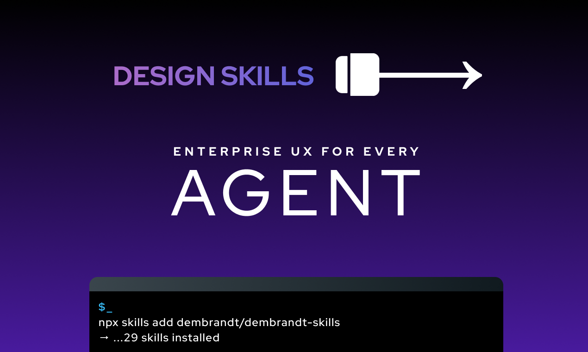

# dembrandt-skills



UX and design system skills for AI agents. Install once, and your agent knows how to design.

```bash
npx skills add dembrandt/dembrandt-skills
```

## What this is

A set of opinionated, practical skills covering the fundamentals of good UI: hierarchy, typography, accessibility, interaction patterns. Distilled from working across hundreds of products and domains — enterprise tools, SaaS, financial platforms, e-commerce, consumer apps, and more. The kind of UX knowledge that usually lives with a senior designer or consultant.

Use with Claude Code or any agent harness that supports the Open Agent Skills format.

## Skills

**Brand & Visual Identity**

| Skill | What it covers |
|---|---|
| `brand-visual-language` | Shape language, icon style, typography tone |
| `color-mode-and-theme` | Light vs dark vs combined, when to offer a theme selector |
| `algorithmic-color-palette` | Derive states and brand-tinted greys from brand colours |

**Design Tokens & Scales**

| Skill | What it covers |
|---|---|
| `modular-scale-typography` | Ratio-based type scales, minimum sizes, context-aware usage |
| `elevation-and-depth` | Shadow scale, border-radius, card and modal patterns |
| `button-states` | Six states: rest, hover, active, focus, disabled, loading |
| `component-family-consistency` | Buttons, inputs, pills: shared radius, colour, height |

**Layout & Structure**

| Skill | What it covers |
|---|---|
| `gestalt-ui-organisation` | Group related controls: proximity, similarity, common region |
| `visual-emphasis-and-hierarchy` | One CTA per view, colour and size as emphasis |
| `information-architecture` | Naming, mental models, data UI, confirm dialogs |
| `ui-context-and-scope` | Hierarchy, breadcrumbs, colour regions, scope communication |
| `responsive-paradigms` | Mobile/tablet/desktop: nav, sections, sticky behaviour |
| `ui-density` | Match density to platform and user type |
| `sticky-and-fixed-elements` | Headers, bottom toolbars, z-index tokens |
| `scroll-areas` | Avoid inner scroll, one axis only, user-controlled |

**Components & Interaction**

| Skill | What it covers |
|---|---|
| `real-world-metaphors` | Cards, carousels, drawers: when to use and how |
| `form-design` | Helper text, placeholder, validation, submit state |
| `data-display-and-selection` | Grid/list/table, large hit areas, mass actions |
| `global-toolbar-controls` | Currency, language, locale: placement and typography |
| `notifications-and-recovery` | Toasts, banners, retry, undo — always a path forward |
| `status-colors-and-errors` | Minimal semantic colours, error recovery, prevention |

**UX Principles**

| Skill | What it covers |
|---|---|
| `nielsen-usability-heuristics` | 10 usability principles with review checklists |
| `wcag-accessibility` | WCAG 2.2 AA / EN 301 549: contrast, keyboard, ARIA |
| `user-flows-and-guided-paths` | Wizards, purchase flows, onboarding sequences |
| `micro-interactions` | Animated icons, toggles, reveals, celebrations |
| `motion-and-storytelling` | Disney principles and cinematic language in UI |

**Technical Foundation**

| Skill | What it covers |
|---|---|
| `semantic-html-and-seo` | HTML5, alt texts, Open Graph, progressive enhancement |
| `performance-and-web-vitals` | Lighthouse audit, LCP, CLS, INP, images, fonts, JS loading |

**Pipeline**

| Skill | What it covers |
|---|---|
| `generate-ui-from-brand` | URL or DESIGN.md → tokens → decisions → UI spec |

## License

MIT
