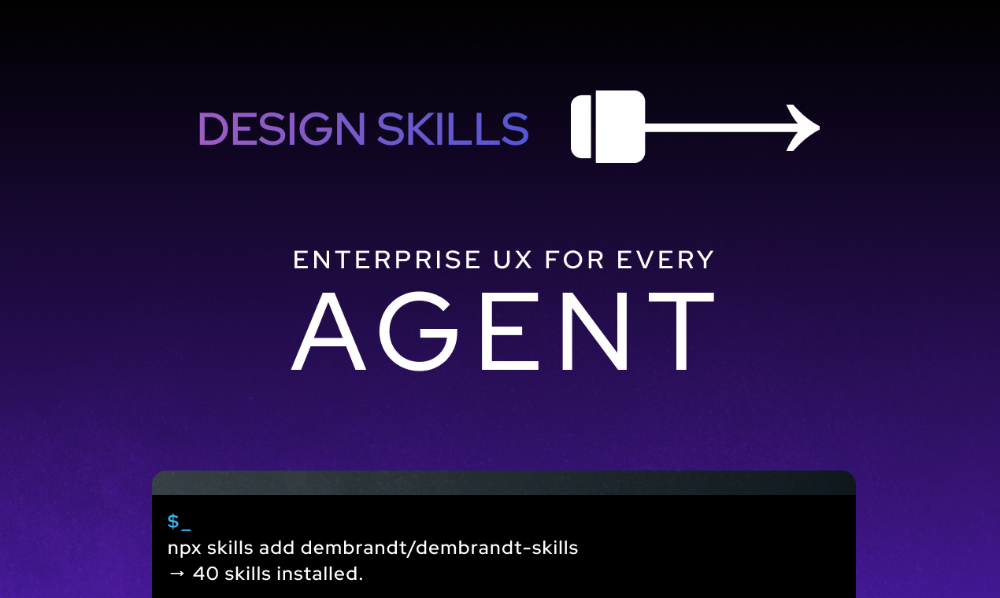

# dembrandt-skills

[](https://skills.sh/dembrandt/dembrandt-skills)



UX and design-system skills for AI agents. Install once, and your agent knows how to design.

```bash
npx skills add dembrandt/dembrandt-skills --all
```

`--all` installs every skill at once. They load only when a prompt needs them, so there is no runtime cost to having them all. Want to pick by hand? Drop `--all` for an interactive picker. Add `--global` to install across all your projects.

## How to use

A skill is just instructions your agent reads. You don't run it. The agent reads each skill's description and loads the matching one when your request fits.

1. Install with the command above, then start a new session. Skills load at session start.
2. Ask in plain words. "What layout fits a list of orders?" or "Does this pass WCAG AA?" loads the right skill on its own.
3. For a full pass, ask broadly ("review this screen", "build a UI from this brand") and the `dembrandt` skill runs the whole pipeline.

No special syntax. You can name a skill to force it ("use the layout skill"), but you rarely need to. Run `npx skills list` to see what's installed.

## Connect the engine (optional)

Most skills are pure knowledge and work on their own. Two of them, `extract-design` and `generate-ui-from-brand`, read **real** design tokens off a live website. That needs the [`dembrandt`](https://npm.im/dembrandt) engine. Connect it as an MCP server. There is nothing to install first, `npx` fetches it on first run:

```json
{
  "mcpServers": {
    "dembrandt": {
      "command": "npx",
      "args": ["-y", "--package", "dembrandt", "dembrandt-mcp"]
    }
  }
}
```

Add this to your agent's MCP config. In Claude Code, this repo already ships a `.mcp.json`, so it connects automatically when you work in the project. Prefer the CLI? `npx -y dembrandt https://stripe.com` works without any config.

## What this is

Opinionated, practical skills covering the fundamentals of good UI: hierarchy, typography, accessibility, interaction patterns. Distilled from working across hundreds of products and domains: enterprise tools, SaaS, financial platforms, e-commerce, consumer apps, and more. The kind of UX knowledge that usually lives with a senior designer or consultant.

Works with Claude Code and any agent harness that supports the Open Agent Skills format.

## Try it

> "I have one brand colour: #133174. Build me a full UI palette."

> "My font sizes feel random. Set up a proper type scale."

> "Review this interface for usability issues."

> "We have buttons, inputs, and badges that look like they're from three different products."

> "Design a multi-step onboarding flow for a B2B SaaS tool."

> "Does this pass WCAG 2.2 AA?"

> "Extract the design system from stripe.com." *(needs the engine, see [Connect the engine](#connect-the-engine-optional))*

## Skills

**Brand & Visual Identity**

| Skill | What it covers |
|---|---|
| `brand-visual-language` | Shape language, icon style, typography tone |
| `color-mode-and-theme` | Light vs dark vs combined, when to offer a theme selector |
| `algorithmic-color-palette` | Derive states and brand-tinted greys from brand colours |

**Design Tokens & Scales**

| Skill | What it covers |
|---|---|
| `modular-scale-typography` | Ratio-based type scales, minimum sizes, context-aware usage |
| `elevation-and-depth` | Shadow scale, border-radius, card and modal patterns |
| `button-states` | Six states: rest, hover, active, focus, disabled, loading |
| `component-family-consistency` | Buttons, inputs, pills: shared radius, colour, height |

**Layout & Structure**

| Skill | What it covers |
|---|---|
| `layout-paradigms-and-consistency` | Choose the layout paradigm that fits the content; reuse the page skeleton across screens |
| `gestalt-ui-organisation` | Group related controls: proximity, similarity, common region |
| `visual-emphasis-and-hierarchy` | One CTA per view, colour and size as emphasis |
| `information-architecture` | Naming, mental models, data UI, confirm dialogs |
| `ui-context-and-scope` | Hierarchy, breadcrumbs, colour regions, scope communication |
| `responsive-paradigms` | Mobile/tablet/desktop: nav, sections, sticky behaviour |
| `ui-density` | Match density to platform and user type |
| `sticky-and-fixed-elements` | Headers, bottom toolbars, z-index tokens |
| `scroll-areas` | Avoid inner scroll, one axis only, user-controlled |

**Components & Interaction**

| Skill | What it covers |
|---|---|
| `real-world-metaphors` | Cards, carousels, drawers: when to use and how |
| `form-design` | Helper text, placeholder, validation, submit state |
| `tab-navigation` | Tab types, overflow handling, roving tabindex, ARIA tablist, URL state |
| `modal-and-overlay-patterns` | Overlay hierarchy, focus trap, dismiss rules, destructive confirms |
| `data-display-and-selection` | Grid/list/table, large hit areas, mass actions |
| `repeated-component-alignment` | Repeated components as slot models: equal size, pinned anchors, clamp + recover text |
| `operational-expert-tool-ui` | Dense, workflow-driven UIs for trained daily B2B users |
| `coordinated-data-views` | Keep a table and a visual view (map, diagram, chart) in sync |
| `domain-expert-configuration` | Expose solver/algorithm settings in domain language |
| `global-toolbar-controls` | Currency, language, locale: placement and typography |
| `notifications-and-recovery` | Toasts, banners, retry, undo: always a path forward |
| `status-colors-and-errors` | Minimal semantic colours, error recovery, prevention |

**UX Principles**

| Skill | What it covers |
|---|---|
| `nielsen-usability-heuristics` | 10 usability principles with review checklists |
| `wcag-accessibility` | WCAG 2.2 AA / EN 301 549: contrast, keyboard, ARIA |
| `user-flows-and-guided-paths` | Wizards, purchase flows, onboarding sequences |
| `authentic-product-representation` | Real content and real output over staged mockups and marketing chrome |
| `micro-interactions` | Animated icons, toggles, reveals, celebrations |
| `loading-states-and-perceived-performance` | Spinners, skeleton screens, and staggered entry animations |
| `motion-and-storytelling` | Disney principles and cinematic language in UI |

**Technical Foundation**

| Skill | What it covers |
|---|---|
| `semantic-html-and-seo` | HTML5, alt texts, Open Graph, progressive enhancement |
| `performance-and-web-vitals` | Lighthouse audit, LCP, CLS, INP, images, fonts, JS loading |

**Pipeline & Orchestration**

| Skill | What it covers |
|---|---|
| `extract-design` | Extract real design tokens from any live website via Dembrandt CLI or MCP (requires dembrandt ≥ 0.23.1) |
| `generate-ui-from-brand` | URL or DESIGN.md to tokens to decisions to UI spec (requires dembrandt ≥ 0.23.1) |
| `dembrandt` | Full 6-stage UX orchestrator: brand, tokens, layout, components, polish, a11y gate |

## Ecosystem

Part of [dembrandt](https://github.com/dembrandt/dembrandt): the engine extracts a brand's real design tokens from any URL, these skills give your agent the UX knowledge to use them well.

## License

MIT
