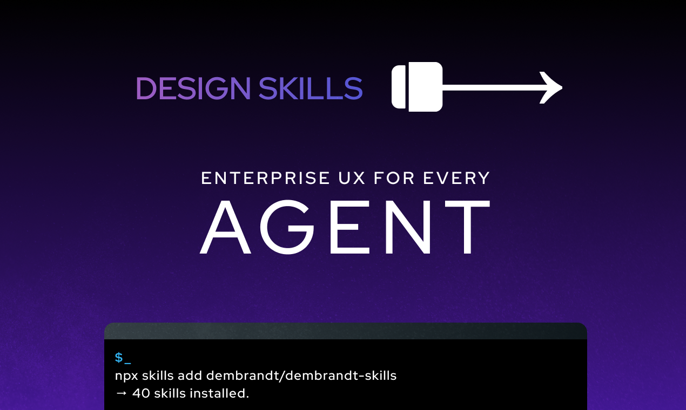

# dembrandt-skills

[](https://skills.sh/dembrandt/dembrandt-skills)
[](https://github.com/dembrandt/dembrandt-skills/actions/workflows/test.yml)
[](LICENSE)



**Enterprise UX secrets most people never learn, now built into your AI agent.**

An agent can write a component in seconds. It cannot tell whether the modal should have been a drawer, or whether the grey it picked is readable. Senior designers can, and most of what they know never gets written down.

This is that knowledge, written down. Each skill is one trick of the trade: what to do, and what breaks otherwise. Works with Claude Code, Cursor, Codex, GitHub Copilot and any agent that reads the Open Agent Skills format.

## Quick start

```bash
npx skills add dembrandt/dembrandt-skills --all
```

Skills load only when a prompt needs them, so `--all` costs nothing. `--global` installs for every project.

## Usage

Ask in your own words and the matching skill loads. Ask broadly, "review this screen", and the dembrandt skill runs the whole pipeline.

| Ask | What loads |
|---|---|
| I have one brand colour, #133174. Build me a full UI palette. | algorithmic-color-palette |
| My font sizes feel random. Set up a proper type scale. | modular-scale-typography |
| Review this interface for usability issues. | nielsen-usability-heuristics |
| Our buttons, inputs and badges look like three different products. | component-family-consistency |
| Design a multi-step onboarding flow for a B2B SaaS tool. | user-flows-and-guided-paths |
| Does this pass WCAG 2.2 AA? | wcag-accessibility |
| Extract the design system from stripe.com. | extract-design, needs the [engine](#the-engine-optional) |

## Skills

**Brand & Visual Identity**

| Skill | What it covers |
|---|---|
| `brand-visual-language` | Shape language, icon style, typography tone |
| `color-mode-and-theme` | Light vs dark vs combined, when to offer a theme selector |
| `marketing-vs-product-system` | What a marketing site and the product may differ on, and what is drift |
| `algorithmic-color-palette` | Derive states and brand-tinted greys from brand colours |

**Design Tokens & Scales**

| Skill | What it covers |
|---|---|
| `modular-scale-typography` | Ratio-based type scales, minimum sizes, context-aware usage |
| `elevation-and-depth` | Shadow scale, border-radius, card and modal patterns |
| `surface-separation` | One separation strategy per surface; opacity as state, not tint |
| `button-states` | Six states: rest, hover, active, focus, disabled, loading |
| `component-family-consistency` | Buttons, inputs, pills: shared radius, colour, height |
| `sizing-units` | px vs rem vs relative: which values move when the user enlarges text |

**Layout & Structure**

| Skill | What it covers |
|---|---|
| `layout-paradigms-and-consistency` | Choose the layout paradigm that fits the content; reuse the page skeleton across screens |
| `gestalt-ui-organisation` | Group related controls: proximity, similarity, common region |
| `visual-emphasis-and-hierarchy` | One CTA per view, colour and size as emphasis |
| `information-architecture` | Naming, mental models, data UI, confirm dialogs |
| `ui-context-and-scope` | Hierarchy, breadcrumbs, colour regions, scope communication |
| `responsive-paradigms` | Mobile/tablet/desktop: nav, sections, sticky behaviour |
| `ui-density` | Match density to platform and user type |
| `sticky-and-fixed-elements` | Headers, bottom toolbars, z-index tokens |
| `scroll-areas` | Avoid inner scroll, one axis only, user-controlled |

**Components & Interaction**

| Skill | What it covers |
|---|---|
| `real-world-metaphors` | Cards, carousels, drawers: when to use and how |
| `form-design` | Helper text, placeholder, validation, submit state |
| `tab-navigation` | Tab types, overflow handling, roving tabindex, ARIA tablist, URL state |
| `modal-and-overlay-patterns` | Overlay hierarchy, focus trap, dismiss rules, destructive confirms |
| `data-display-and-selection` | Grid/list/table, large hit areas, mass actions |
| `repeated-component-alignment` | Repeated components as slot models: equal size, pinned anchors, clamp + recover text |
| `operational-expert-tool-ui` | Dense, workflow-driven UIs for trained daily B2B users |
| `coordinated-data-views` | Keep a table and a visual view (map, diagram, chart) in sync |
| `domain-expert-configuration` | Expose solver/algorithm settings in domain language |
| `app-shell` | Top bar, app launcher, tenant and environment cue, status bar: one shell across an estate |
| `global-toolbar-controls` | Currency, language, region and unit selectors: frequent but not primary |
| `notifications-and-recovery` | Toasts, banners, retry, undo: always a path forward |
| `status-colors-and-errors` | Minimal semantic colours, error recovery, prevention |

**UX Principles**

| Skill | What it covers |
|---|---|
| `nielsen-usability-heuristics` | 10 usability principles with review checklists |
| `wcag-accessibility` | WCAG 2.2 AA / EN 301 549: contrast, keyboard, ARIA |
| `user-flows-and-guided-paths` | Wizards, purchase flows, onboarding sequences |
| `authentic-product-representation` | Real content and real output over staged mockups and marketing chrome |
| `micro-interactions` | Animated icons, toggles, reveals, celebrations |
| `loading-states-and-perceived-performance` | Spinners, skeleton screens, and staggered entry animations |
| `motion-and-storytelling` | Disney principles and cinematic language in UI |

**Technical Foundation**

| Skill | What it covers |
|---|---|
| `semantic-html-and-seo` | HTML5, alt texts, Open Graph, progressive enhancement |
| `performance-and-web-vitals` | Lighthouse audit, LCP, CLS, INP, images, fonts, JS loading |

**Pipeline & Orchestration**

| Skill | What it covers |
|---|---|
| `extract-design` | Extract real design tokens from any live website via Dembrandt CLI or MCP (requires dembrandt ≥ 0.23.1) |
| `clone-website` | Rebuild a live page 1:1 from capture and computed styles, into Figma, Penpot or code |
| `generate-ui-from-brand` | URL or DESIGN.md to tokens to decisions to UI spec (requires dembrandt ≥ 0.23.1) |
| `dembrandt` | Full 6-stage UX orchestrator: brand, tokens, layout, components, polish, a11y gate |

## The engine (optional)

These skills are one half of [dembrandt](https://github.com/dembrandt/dembrandt). The engine is the other.

The engine reads a live URL and returns the brand as it actually renders: colours, type, spacing, shadows, components, as W3C design tokens, in seconds. Run it once and you have a baseline. Run it in CI and every pull request is checked against that baseline, so drift shows up before it ships. No guessing hex codes, no digging through DevTools.

The skills give the agent the judgment to use those tokens well: which layout fits the content, when a modal is wrong, what the type scale should be, whether the result passes WCAG 2.2 AA. Tokens say what the brand is. Skills say what good looks like.

Most skills are pure knowledge and need no engine. Two of them, `extract-design` and `generate-ui-from-brand`, read real tokens off a live site and need it. Connect it as an MCP server; `npx` fetches it on first run:

```json
{
  "mcpServers": {
    "dembrandt": {
      "command": "npx",
      "args": ["-y", "--package", "dembrandt", "dembrandt-mcp"]
    }
  }
}
```

In Claude Code this repo ships a `.mcp.json`, so it connects on its own when you work here. Prefer the CLI? `npx -y dembrandt https://stripe.com` works with no config.

Both are free and open source. The engine runs in your terminal and inside Claude Code, Cursor and Windsurf via MCP.

**Start with the engine: `npm i -g dembrandt`, then `dembrandt https://your-site.com`. → [dembrandt.com](https://dembrandt.com)**

## How the skills grow

The base skills cover the fundamentals: hierarchy, typography, accessibility, interaction patterns. The knowledge that usually lives with a senior designer or consultant.

The rest comes from field work. When a real interface gets something wrong, we record the failure, the fix, and why the obvious fix was wrong. Once the rule stands on its own, without the product that produced it, it goes into the skill it belongs to, with what breaks otherwise. New judgements land every few weeks.

## Contributing

Changes to `skills/**` go through a pull request, however small. A push to `main` is live to every install. Run `npm test` before opening one; CI validates frontmatter, cross-links and the manifest.

## License

MIT
